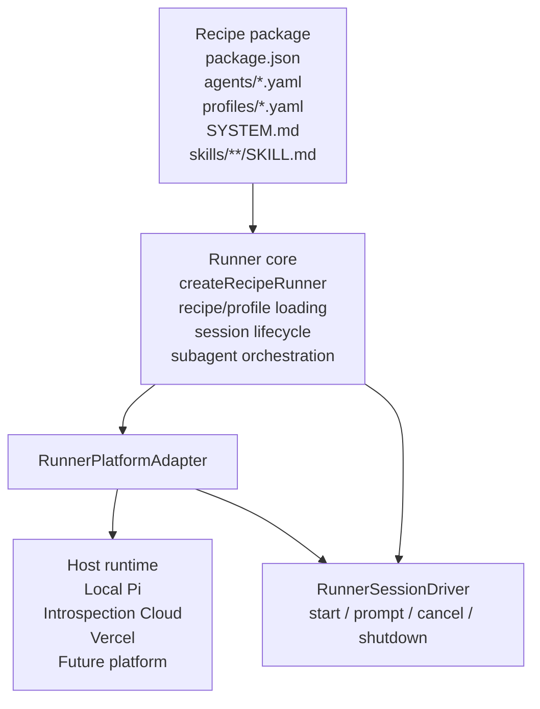
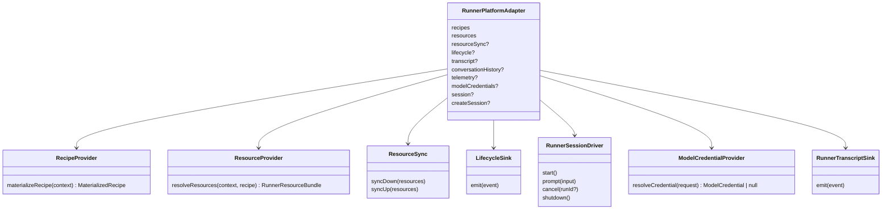
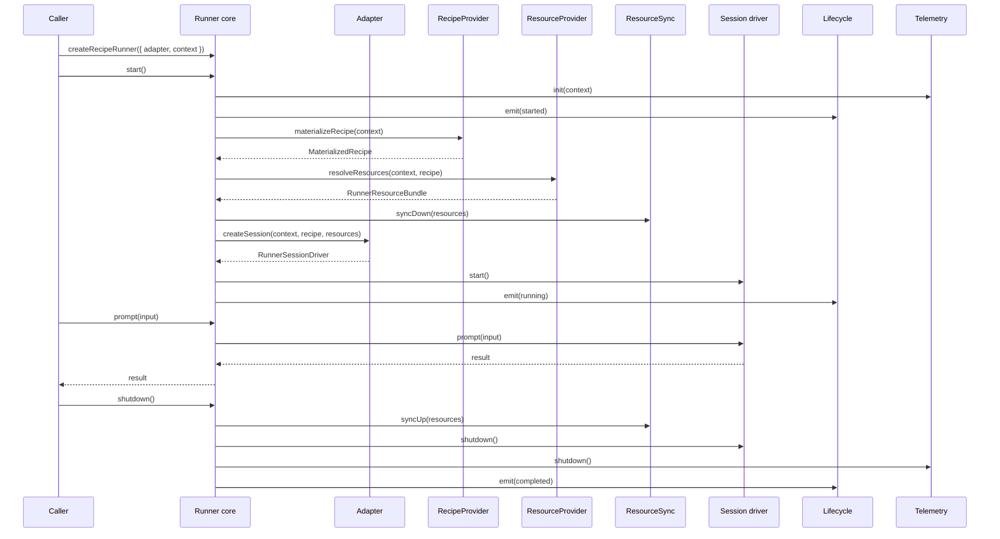
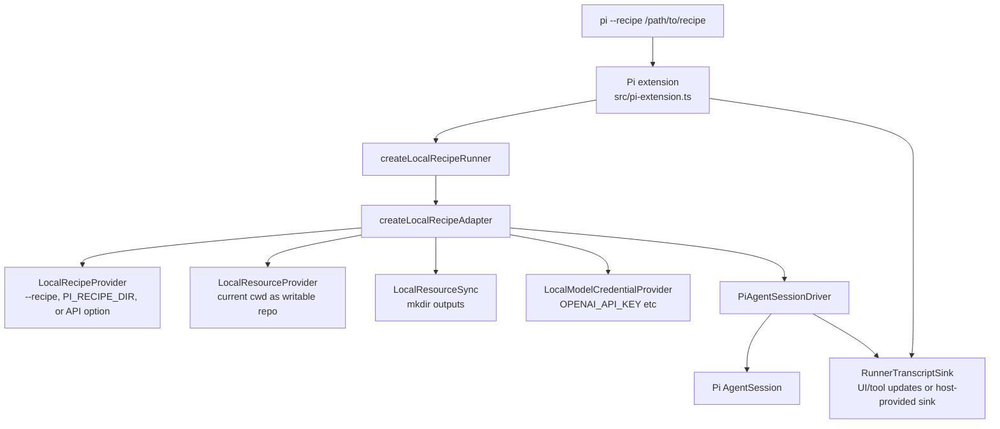
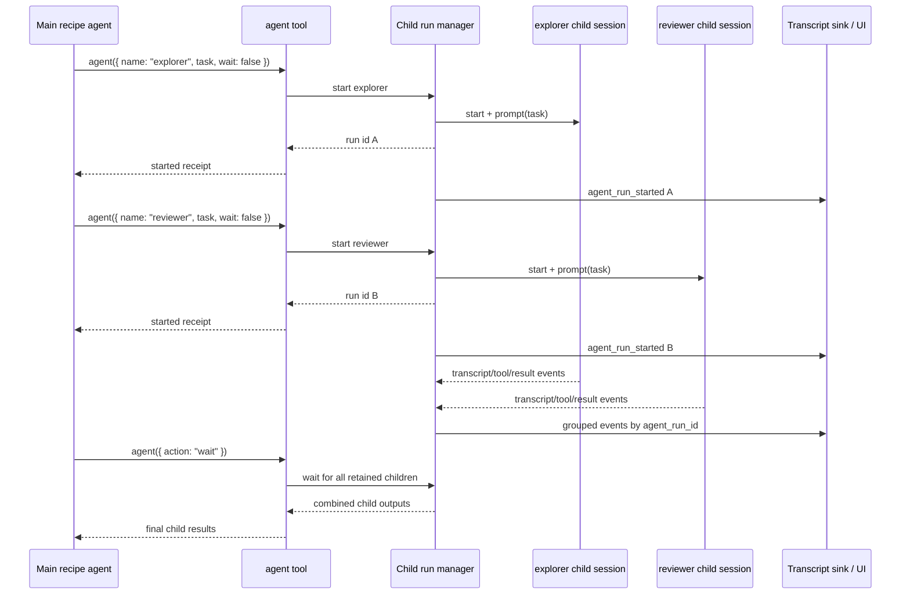
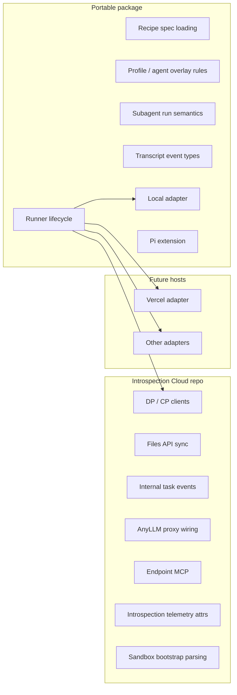
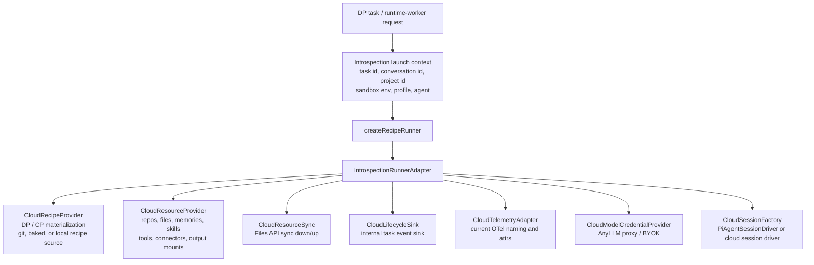
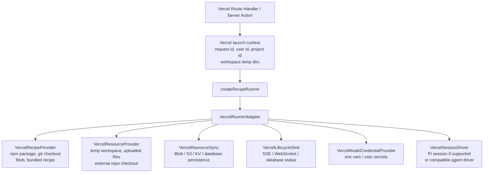

# Runtime Adapter Architecture

This document explains how `@introspection/pi-recipes` separates portable recipe specifications from the runtime that executes them, how the current local runtime works, and what it would mean to host the same recipe runner on Introspection Cloud or Vercel.

## Design Goal

A Pi recipe should be a portable agent brain:

- manifest and package metadata;
- agent YAML files;
- profile YAML files;
- prompts;
- skills;
- subagent declarations;
- model/tool/skill/profile overlay rules.

Those files should not know whether they are running inside the local Pi app, Introspection's sandbox runtime, Vercel, or another host. The runtime-specific pieces live behind a `RunnerPlatformAdapter`.

The boundary is:

```text
recipe files and folders = portable specification
runner core              = neutral orchestration
platform adapter         = host-specific materialization/resources/session plumbing
```

## High-Level Shape



The core owns recipe semantics. The adapter owns host integration.

## Current Package Responsibilities

`@introspection/pi-recipes` owns:

- recipe package manifest reading and validation;
- agent/profile loading;
- recipe system prompt loading;
- profile/agent selection;
- local resource layout;
- local Pi `AgentSession` driver;
- local Pi extension launch surface;
- transcript events for the Pi extension UI;
- subagent tool semantics for local recipe runs.

It does not own Introspection cloud behavior such as DP/CP clients, Files API sync, task lifecycle events, AnyLLM proxy setup, endpoint MCP, sandbox bootstrap parsing, or Introspection telemetry attributes.

## Adapter Interface

The key interface is `RunnerPlatformAdapter` from `src/adapter.ts`:

```ts
interface RunnerPlatformAdapter<
  TContext extends RunnerLaunchContext = RunnerLaunchContext,
  TRecipe extends MaterializedRecipe = MaterializedRecipe,
  TResources = RunnerResourceBundle,
> {
  recipes: RecipeProvider<TContext, TRecipe>;
  resources: ResourceProvider<TContext, TRecipe, TResources>;
  resourceSync?: ResourceSync<TResources>;
  lifecycle?: LifecycleSink;
  transcript?: RunnerTranscriptSink;
  conversationHistory?: ConversationHistoryProvider;
  telemetry?: TelemetryAdapter;
  modelCredentials?: ModelCredentialProvider;
  session?: RunnerSessionDriver;
  createSession?: RunnerSessionFactory<TContext, TRecipe, TResources>;
}
```

The sub-interfaces split host concerns into smaller responsibilities:



## Runner Lifecycle

`createRecipeRunner()` coordinates the adapter in a fixed sequence:



The core does not know how recipes are fetched, how repositories are mounted, how artifacts are persisted, or where events are sent. It only knows the sequence.

## Local Runtime Today

The local runtime is implemented by `createLocalRecipeAdapter()` and `PiAgentSessionDriver`.



Local mode supplies a fixed local adapter. Users do not choose adapters from the Pi extension. The launch flags assume local execution and use the current Pi working directory as the project workspace.

Local runtime responsibilities:

- materialize a recipe from a local directory;
- treat the current project directory as the writable repository;
- create the local output mount directory;
- use local provider API keys from environment variables;
- create a Pi `AgentSession`;
- stream transcript events to a host-provided `RunnerTranscriptSink` when one is configured;
- surface recipe skills, prompts, themes, and extensions through Pi resource loading.

## Subagent Runs

Subagents are recipe behavior, not local-adapter behavior.

The recipe agent YAML can declare subagents. The session driver exposes those subagents through an `agent` tool. The reusable session-driver tool supports retained child runs:

- `action: "start"` or omitted: start a child agent run;
- `wait: false` by default: return a run id immediately so several subagents can run in parallel;
- `wait: true`: start and block until that child returns;
- `action: "status"`: list retained child runs;
- `action: "wait"`: wait for one child run or all child runs;
- `action: "interrupt"`: cancel a running child;
- `action: "close"`: close a retained child run.

The Pi launch extension also registers an `agent` tool for the live local session. That tool has the same management actions, but its `start` action waits by default so the tool block can stream the delegated prompt and output inline. Pass `wait: false` there when a background child run is desired.



This belongs in the portable recipe runtime layer because local, cloud, and future hosts should agree on what `agent(...)` means. The adapter only provides the session factory and sinks needed to execute and observe those runs.

## Transcript Events

The runner emits neutral transcript events. The local Pi extension can render subagent output as grouped tool updates, and direct runner users can provide any `RunnerTranscriptSink` they want.

Example event types:

- `run_started`;
- `session_started`;
- `user_prompt`;
- `assistant_message`;
- `tool_call`;
- `tool_result`;
- `skill_loaded`;
- `skill_used`;
- `agent_run_started`;
- `agent_run_completed`;
- `session_completed`;
- `run_completed`;
- `run_failed`.

Subagent events carry enough metadata for grouping:

```json
{
  "type": "tool_result",
  "runId": "local-...",
  "agentName": "explorer",
  "data": {
    "agent_role": "subagent",
    "agent_name": "explorer",
    "agent_run_id": "...",
    "name": "bash",
    "text": "..."
  }
}
```

The important point is that transcript events are not Pi-extension-only. A cloud adapter can forward them to DP task events, logs, traces, or a web UI. A Vercel adapter could stream them over SSE, WebSockets, or store them in a database.

## What Belongs Where



Portable package:

- defines recipe semantics;
- defines runner interfaces;
- implements local execution;
- implements local Pi extension UX;
- may expose testing helpers.

Introspection Cloud adapter:

- imports portable interfaces;
- implements cloud-specific providers and sinks;
- preserves task lifecycle payloads and telemetry naming;
- does not move cloud clients into this package.

Future adapters:

- import the portable package;
- implement their own materialization, resources, session, lifecycle, transcript, and credential behavior.

## Switching Runtime: Local to Introspection Cloud

The cloud adapter would live in `introspection-cloud`, not in this repo. It would plug existing runtime-worker behavior into the same `RunnerPlatformAdapter` interface.



Cloud adapter mapping:

| Adapter piece | Introspection implementation |
| --- | --- |
| `recipes.materializeRecipe` | existing recipe materialization from runtime-worker, including baked/git-pinned/local sandbox recipe sources |
| `resources.resolveResources` | existing task resource bundle resolution from DP/CP state |
| `resourceSync.syncDown` | Files API download, memory/materialized-resource setup, artifact/input staging |
| `resourceSync.syncUp` | Files API artifact upload, memory/output persistence |
| `lifecycle.emit` | existing `/internal/tasks/{task_id}/events` signaling with unchanged payloads |
| `transcript.emit` | stream/forward neutral transcript events into existing task/conversation surfaces |
| `conversationHistory` | DP previous-response lookup for resumed sessions |
| `telemetry` | current `initTelemetry` / `shutdownTelemetry`, current span/resource attrs |
| `modelCredentials` | AnyLLM managed proxy and BYOK credential behavior |
| `createSession` | create the actual coding-agent/Pi session inside the sandbox |

Cloud mode should preserve all current external behavior:

- same runtime-worker routes;
- same task event payloads;
- same sandbox env vars;
- same telemetry names;
- same deployment schema;
- same Files API behavior.

Only the internal wiring changes: runtime-worker calls the portable runner instead of duplicating runner orchestration inline.

### Introspection Cloud Sketch

```ts
import {
  createRecipeRunner,
  type RunnerPlatformAdapter,
} from "@introspection/pi-recipes";

export function createIntrospectionRunner(request: RuntimeWorkerRequest) {
  const context = contextFromSandboxBootstrap(request);
  const adapter: RunnerPlatformAdapter = {
    recipes: new IntrospectionRecipeProvider(request.dpClient, request.cpClient),
    resources: new IntrospectionResourceProvider(request.dpClient, request.cpClient),
    resourceSync: new IntrospectionResourceSync(request.filesClient),
    lifecycle: new IntrospectionTaskLifecycleSink(request.dpClient, request.taskId),
    transcript: new IntrospectionTranscriptSink(request.dpClient, request.taskId),
    conversationHistory: new DPConversationHistoryProvider(request.dpClient),
    telemetry: new IntrospectionTelemetryAdapter(request.telemetryConfig),
    modelCredentials: new IntrospectionModelCredentialProvider(request.sessionMaterialization),
    createSession: (context, recipe, resources) =>
      createCloudPiSessionDriver({ context, recipe, resources, request }),
  };

  return createRecipeRunner({
    adapter,
    context,
    profileName: request.profileName,
    agentName: request.agentName,
  });
}
```

That code belongs in `introspection-cloud`, because every named provider above depends on Introspection-specific APIs.

## Switching Runtime: Local to Vercel

A Vercel adapter would be different from both local Pi and Introspection Cloud. It would not use the Pi extension UI, and it probably would not have access to the user's local filesystem unless the application provided files through upload, git checkout, blob storage, or a mounted build artifact.



The Vercel adapter would answer these questions:

- Where does the recipe come from?
  - bundled with the app;
  - fetched from git;
  - uploaded by the user;
  - loaded from Blob/object storage.

- Where is the workspace?
  - temporary directory under the Vercel runtime;
  - pre-fetched git checkout;
  - synthetic workspace assembled from uploaded files.

- How are outputs persisted?
  - Vercel Blob;
  - S3/R2;
  - Postgres;
  - returned directly in the HTTP response for small runs.

- How are lifecycle/transcript events exposed?
  - SSE from a route handler;
  - WebSocket through a separate realtime service;
  - polling a database row;
  - background job logs.

- How are model credentials resolved?
  - deployment env vars;
  - encrypted user secrets;
  - a hosted model gateway.

- Can the runtime actually execute a Pi `AgentSession`?
  - If yes, `createSession` can return `PiAgentSessionDriver` or a Vercel-specific wrapper.
  - If no, the adapter must provide another `RunnerSessionDriver` that preserves the runner contract.

### Vercel Sketch

```ts
import {
  createRecipeRunner,
  type RunnerPlatformAdapter,
} from "@introspection/pi-recipes";

export async function POST(request: Request) {
  const body = await request.json();
  const context = createVercelLaunchContext(body);

  const adapter: RunnerPlatformAdapter = {
    recipes: new VercelRecipeProvider({
      source: body.recipeSource,
      blob: vercelBlobClient,
    }),
    resources: new VercelResourceProvider({
      tempRoot: "/tmp/pi-recipes",
      uploads: body.uploads,
    }),
    resourceSync: new VercelResourceSync({
      blob: vercelBlobClient,
      database,
    }),
    lifecycle: new VercelLifecycleSink({
      runId: context.runId,
      database,
    }),
    transcript: new VercelTranscriptSink({
      runId: context.runId,
      stream: body.streamId,
    }),
    modelCredentials: new VercelModelCredentialProvider({
      env: process.env,
      userSecretStore,
    }),
    createSession: (context, recipe, resources) =>
      new VercelRecipeSessionDriver({
        context,
        recipe,
        resources,
        modelCredentials,
      }),
  };

  const runner = createRecipeRunner({ adapter, context });
  await runner.start();
  const result = await runner.prompt(body.prompt);
  await runner.shutdown();

  return Response.json({ run_id: context.runId, result });
}
```

This is intentionally only a shape. Whether it can use the exact local `PiAgentSessionDriver` depends on the Pi runtime's compatibility with the Vercel execution environment.

## Runtime Switching Matrix

| Concern | Local Pi extension | Introspection Cloud | Vercel |
| --- | --- | --- | --- |
| User surface | `pi --recipe` launch flags | task/runtime-worker flow | route handler, server action, API, or job |
| Recipe source | local path from `--recipe`, `PI_RECIPE_DIR`, or API option | DP/CP materialized recipe, baked image, git source | bundled package, git, Blob, upload |
| Workspace | current Pi `ctx.cwd` | sandbox workspace/repo mounts | `/tmp`, git checkout, uploaded file tree |
| Outputs | local output mount | Files API/artifacts/memories | Blob/S3/db/HTTP response |
| Lifecycle | local/no-op plus UI notification | DP internal task events | SSE/WebSocket/db status/polling |
| Transcript | Pi tool/UI updates or supplied sink | task/conversation stream | SSE/WebSocket/db/log sink |
| Credentials | local env vars | AnyLLM proxy/BYOK/session materialization | env vars/user secrets/gateway |
| Session | local Pi `AgentSession` | sandbox coding-agent/Pi session | Pi-compatible driver or custom session driver |
| Subagents | portable `agent` tool semantics | same semantics through cloud session | same semantics if session driver supports child sessions |

## Adapter Contract Gaps To Watch

The current adapter boundary is enough for isolated local runs and for a compatibility refactor of cloud runtime-worker wiring. A few gaps should become explicit before building richer hosted products:

1. Resumable sessions

   The runner has `prompt()` and `cancel()`, but it does not yet expose a durable run handle that can be reattached across processes. Cloud and Vercel hosts may need `resumeSession()` or a session registry abstraction.

2. Transcript pagination and replay

   The `RunnerTranscriptSink` is write-oriented. UIs that load old runs need a read/query interface over transcript events. Today that belongs to the host's storage layer.

3. Structured skill invocation

   The local driver can report loaded skills and best-effort explicit skill use. A precise "model invoked this skill" event requires the underlying Pi session runtime to emit a structured skill invocation event.

4. Resource policy enforcement

   `RunnerResourceBundle` describes resources, but host-specific enforcement still lives in each session driver or platform sandbox. If recipes need portable resource policy semantics, the core should define them more strongly.

5. Background execution lifecycle

   Vercel and cloud hosts may split `start`, `prompt`, and `shutdown` across queue jobs or serverless invocations. That needs durable runner state, not just an in-memory `RecipeRunner` object.

6. Session-driver capability declaration

   Future adapters should be able to declare whether they support shell tools, file edits, subagents, skill loading, streaming transcript events, cancellation, and long-running background work.

## Rule Of Thumb

When adding behavior, ask:

```text
Would the recipe behave differently if the same files ran locally, in Introspection Cloud, or on Vercel?
```

If the answer should be no, put it in the portable package/core.

Examples:

- agent/profile loading;
- profile overlays;
- subagent `agent` tool semantics;
- transcript event vocabulary;
- contract errors;
- recipe validation.

If the answer depends on the host, put it in an adapter.

Examples:

- how to fetch a recipe;
- where files are mounted;
- how credentials are resolved;
- how outputs are persisted;
- how lifecycle events are delivered;
- how telemetry is named;
- how the actual session process is created.
